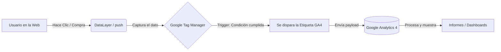

# Resolución del Taller: Analítica Web (GA4 y GTM)

**Nota del Arquitecto (Leela antes de entregar):** 
*Acá tenés las respuestas, loco. Pero ojo, no las copies y pegues como un robot. Leelas, entendelas y hacelas tuyas. Un buen desarrollador no es el que pica código rápido, es el que entiende el POR QUÉ de las cosas. Si vas a entregar esto, asegurate de poder defender cada punto en una charla. ¡Ponete las pilas que esto te va a hacer destacar del resto del montón!*

---

### 1. ¿Qué es Google Analytics 4 (GA4)?
Es la plataforma de analítica de nueva generación de Google. A diferencia de las versiones anteriores (Universal Analytics) que se basaban en "sesiones" y "páginas vistas", GA4 está basado 100% en **Eventos**. Es el "cerebro" donde se almacenan y visualizan todos los datos de interacción de los usuarios, permitiendo medir tanto sitios web como aplicaciones móviles bajo el mismo modelo de datos.

### 2. ¿Qué se puede hacer con Google Analytics? (5 funcionalidades)
1. **Medir el tráfico y adquisición:** Saber exactamente de dónde vienen tus usuarios (tráfico orgánico, redes sociales, campañas de pago, etc.).
2. **Analizar el comportamiento:** Ver qué rutas toman los usuarios dentro de la app/web y dónde abandonan.
3. **Medir conversiones:** Registrar cuántas personas completan un objetivo clave (compras, registros, clics en "Reservar").
4. **Crear audiencias:** Agrupar usuarios según su comportamiento (ej: "usuarios que agregaron al carrito pero no compraron") para campañas de remarketing.
5. **Analizar tecnología y demografía:** Saber qué dispositivos, sistemas operativos, resoluciones de pantalla y de qué países se conectan los usuarios.

### 3. ¿Qué es Google Tag Manager (GTM)?
Es un Sistema de Gestión de Etiquetas (Tag Management System). Funciona como un "intermediario" o "caja" que se instala una sola vez en el código fuente de la web. A partir de ahí, permite a los equipos de marketing o desarrollo inyectar scripts (etiquetas) de terceros de forma dinámica desde una interfaz web, sin necesidad de tocar el código (HTML/JS) ni requerir nuevos deploys.

### 4. ¿Qué se puede hacer con Google Tag Manager? (5 acciones)
1. **Implementar GA4:** Desplegar el seguimiento base y eventos personalizados de Analytics sin tocar el código.
2. **Instalar Píxeles publicitarios:** Agregar el Pixel de Meta (Facebook), TikTok o Google Ads fácilmente.
3. **Gestión de variables personalizadas:** Capturar datos dinámicos de la web (como el valor de una compra o el ID de un usuario) a través del DataLayer.
4. **Control de versiones y rollback:** Probar etiquetas en un entorno seguro ("Vista previa") y revertir cambios si algo rompe la web en producción.
5. **Optimizar el rendimiento (Performance):** Al cargar los scripts de forma asíncrona y centralizada, evita que el HTML se llene de código basura que ralentice la carga de la página.

### 5. Ciclo de vida de una funcionalidad basada en datos
En software, no programamos por programar. El ciclo es: **Construir -> Medir -> Aprender**.
Cuando lanzás una funcionalidad (ej. un nuevo botón de checkout):
*   **Medir (GA4):** Observás cuántos usuarios lo ven y cuántos hacen clic.
*   **Iterar:** Si lo ven pero no hacen clic, quizás el color o el texto no es claro. Hacés un cambio y volvés a medir.
*   **Escalar:** Si la conversión explota positivamente, le dás más visibilidad o aplicás ese patrón a otras partes del sitio.
*   **Eliminar:** Si después de varias iteraciones la métrica muestra que nadie lo usa y solo genera deuda técnica, se elimina sin piedad.

### 6. Glosario Técnico
*   **DataLayer (Capa de datos):** Es un objeto JavaScript (un array) que funciona como puente entre el código de la web y GTM. Los devs empujan (`push`) información ahí, y GTM la lee.
*   **Evento:** Cualquier interacción medible de un usuario (clic, scroll, compra, vista de página).
*   **Contenedor:** El "recipiente" global de GTM que agrupa todas las etiquetas, activadores y variables de un sitio.
*   **Conversión:** Un evento que tiene un valor crucial para el negocio (ej. una venta o un lead generado).
*   **Etiqueta (Tag):** El fragmento de código (script) que se envía a la web (ej. el script de GA4 o Facebook).
*   **Activador (Trigger):** La regla o condición que dice *CUÁNDO* debe dispararse una etiqueta (ej. "Solo cuando la URL contenga /gracias").
*   **Variables:** Valores dinámicos que pueden cambiar (ej. `precio_carrito`, `click_url`) y se usan en etiquetas o activadores.
*   **Heteromorfo:** En el contexto de datos/sistemas, se refiere a estructuras de datos que no tienen un esquema fijo o que toman múltiples formas (polimorfismo de datos), algo común al recolectar analítica cruda antes de procesarla.
*   **UTM (Urchin Tracking Module):** Parámetros que se agregan al final de una URL (ej. `?utm_source=facebook`) para rastrear el origen exacto del tráfico en Analytics.
*   **Atribución:** El modelo o regla que decide a qué canal (SEO, Ads, Email) se le da el crédito por haber logrado una conversión.
*   **PII (Personally Identifiable Information):** Información de Identificación Personal (nombres, correos, DNI). Por reglas de privacidad (GDPR) y términos de Google, **NUNCA** se debe enviar PII en texto plano a Analytics.

### 7. Diagrama de flujo (Web -> GTM -> GA4)

### 8. ¿Por qué en los productos de software el proceso no termina en el "deploy"?
Porque el software es un organismo vivo. Subir a producción es solo el nacimiento. Si no medís qué hacen los usuarios con tu producto, estás manejando un auto con los ojos vendados. El post-deploy implica monitoreo, analítica, recolección de feedback, corrección de bugs y evolución (mantenimiento continuo). El deploy es el final del desarrollo local, pero el principio del ciclo de valor del producto.

### 9. Explicación de la frase de Lord Kelvin
*"Lo que no se define no se puede medir. Lo que no se mide, no se puede mejorar. Lo que no se mejora, se degrada siempre."*
*   **Definir:** Si no sabés qué es el "éxito" para tu app (ej. "reservas de spa"), no tenés un norte.
*   **Medir:** Sin GA4/GTM, las decisiones se toman por "creencias" o ego ("yo creo que el botón azul es mejor"). Con datos, es una ciencia.
*   **Mejorar/Degradar:** El mercado y los usuarios cambian constantemente. Si tu producto se estanca y no itera basándose en métricas reales, se vuelve obsoleto y la competencia lo supera (se degrada).

### 10. ¿Por qué los devs deben comprender GTM y GA4?
Porque la separación entre "Marketing" y "Desarrollo" ya no existe. El equipo de marketing necesita datos precisos, y la precisión depende de cómo el desarrollador implemente el código base y estructure el DataLayer. Un dev que entiende GTM sabe cómo enviar datos limpios, evita romper la analítica al hacer refactoring del DOM (ej. cambiando IDs o Clases de CSS) y se convierte en un perfil estratégico (Growth Engineer) en lugar de un simple "picador de código".